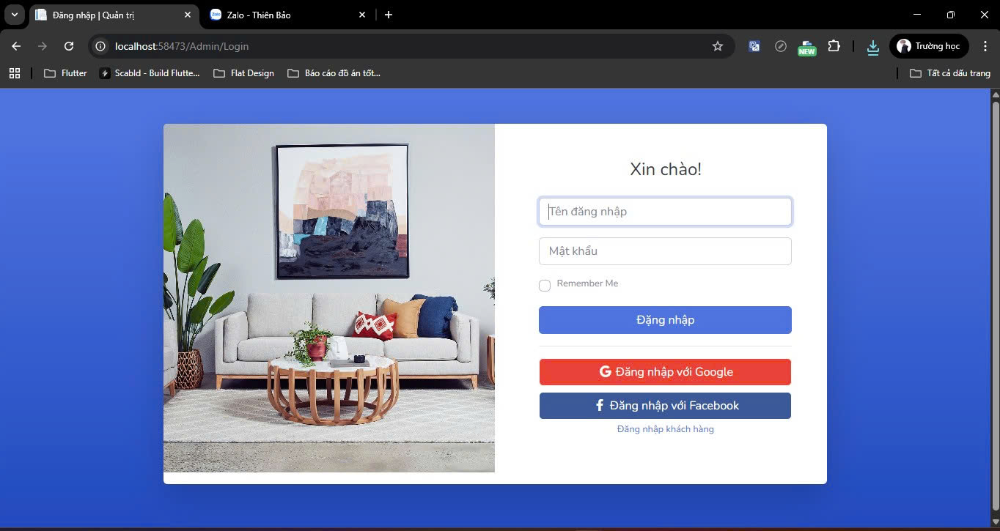
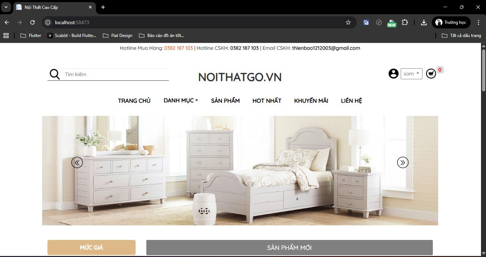
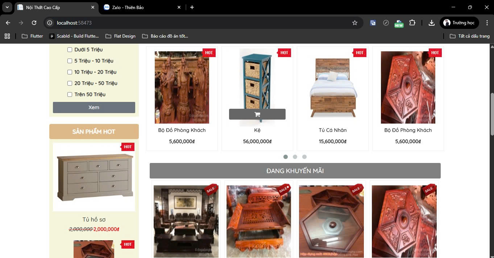
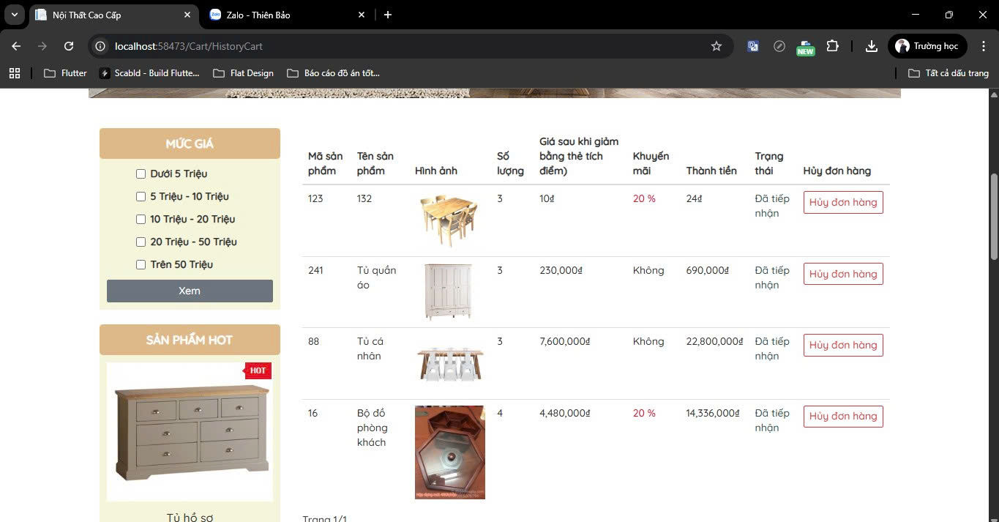
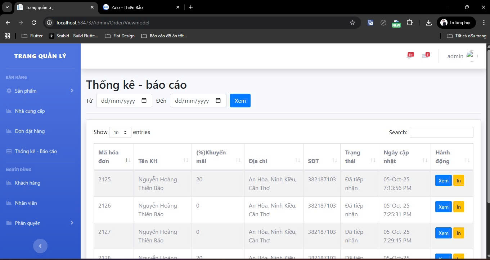
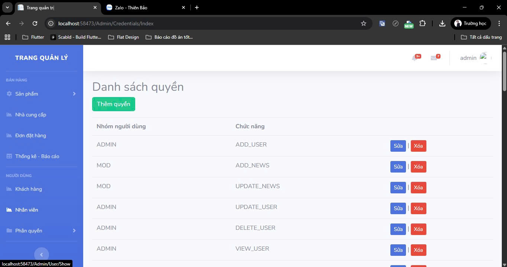

## Furniture E-Commerce Website
A full-stack e-commerce website for selling furniture, designed to provide a seamless shopping experience for users and a comprehensive management system for admins.
## Quick demo video
https://www.youtube.com/watch?v=IWTjWhlcapM
## Screenshots
<h3>User</h3>
<div>
  
  
  
  
</div>

<!-- Mobile App Screenshots -->
<h3>Admin</h3>
<div>
  
  
</div>

## About
This project allows users to:
- Search and filter products by category, name, and price.
- Add, update, and remove items in the shopping cart.
- Place orders and track order status in real-time.
The admin dashboard provides functionalities to:
- Manage products, categories, suppliers, customers, and employees.
- Process orders and confirm delivery.
- View sales statistics and print receipts.
- Control user access with role-based permissions.
## Technology Stack
- Frontend: HTML5, CSS3, JavaScript, Bootstrap
- Backend: C#, ASP.NET Core MVC
- Database: Microsoft SQL Server
## Installation
Prerequisites:
- Visual Studio 2019 (or newer) with ASP.NET and web development workloads installed
- SQL Server (local or remote)
Steps:
  - Clone the repository:
    ```bash
    git clone https://github.com/Thienbao-tb/furniture-store-fullstack.git
    ```
  - Open the solution (.sln) file in Visual Studio.
  - Restore the database from the provided .bak file using SQL Server Management Studio (SSMS) or Azure Data Studio.
  - Build and run the project. The website will be available at https://localhost:5001 (default).
## License
This project is licensed under the MIT License – see the LICENSE file for details.
